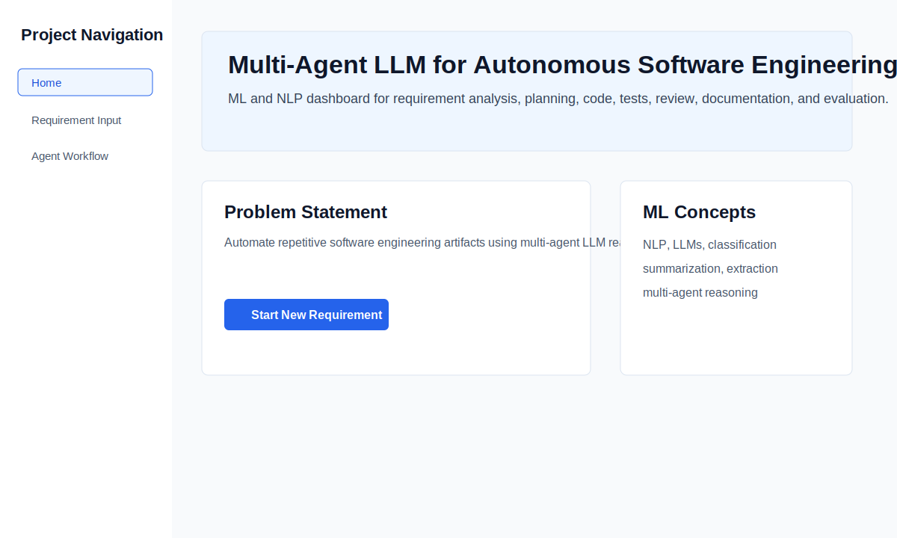
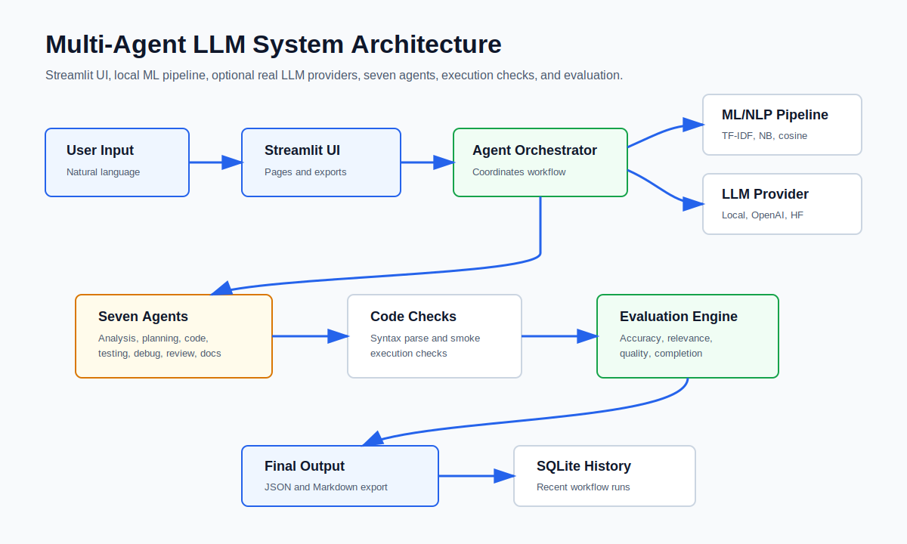
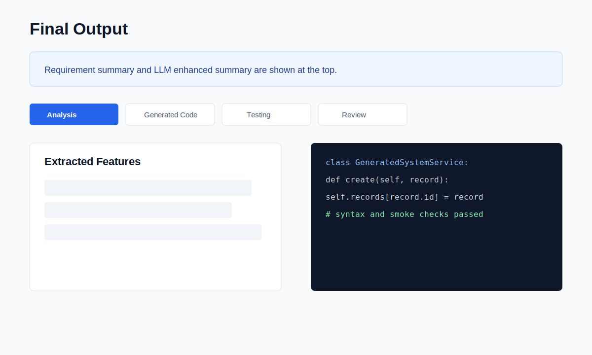
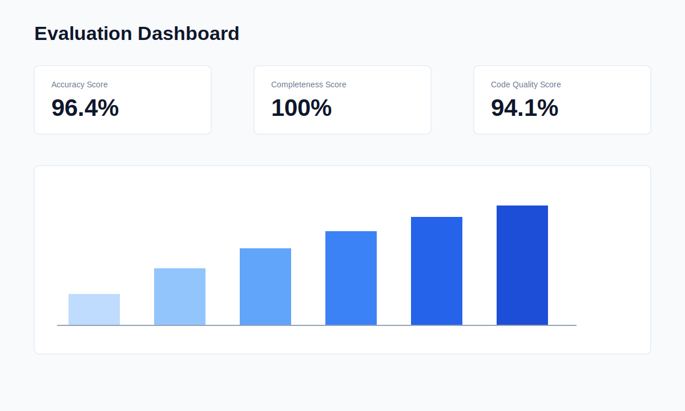

# Multi-Agent LLM for Autonomous Software Engineering



An end-to-end Machine Learning project where multiple intelligent LLM-style agents collaborate to automate software engineering tasks from a natural-language requirement. The system performs requirement analysis, task planning, code generation, testing, debugging, code review, documentation, generated-code execution checks, and evaluation.

The project is designed for final-year ML project submission and presentation. It runs successfully without a paid API key through a local mock LLM and scikit-learn based NLP pipeline, while also supporting optional OpenAI and Hugging Face providers.

## Highlights

- Professional Streamlit dashboard with multiple pages
- Seven-agent autonomous software engineering workflow
- Local ML/NLP pipeline using TF-IDF, Naive Bayes, and cosine similarity
- Optional OpenAI, Hugging Face, and Gemini integration
- Offline-safe mock LLM fallback
- Generated Python code and test cases
- Syntax parsing and controlled smoke execution for generated code
- Evaluation dashboard with quality scores and charts
- JSON and Markdown export of final output
- SQLite run history
- 25-row sample dataset across multiple domains
- Formal project report, architecture diagram, deployment guide, and screenshot previews

## System Architecture



## Agents

| Agent | Responsibility |
| --- | --- |
| Requirement Analysis Agent | Extracts domain, features, modules, inputs, outputs, constraints, and user goals |
| Task Planning Agent | Decomposes the requirement into structured development tasks |
| Code Generation Agent | Generates sample Python service-layer code |
| Testing Agent | Generates functional, negative, boundary, integration, and security test cases |
| Debugging Agent | Detects possible issues and suggests fixes |
| Code Review Agent | Reviews readability, security, performance, and maintainability |
| Documentation Agent | Generates setup guide, module explanation, and deployment notes |

## ML Concepts Demonstrated

- Natural Language Processing
- Large Language Model style reasoning
- Prompt engineering workflow
- Text classification
- Text summarization
- Information extraction
- Multi-agent reasoning
- Task decomposition
- Automated code generation
- Evaluation metrics

## Screenshots





## Tech Stack

- Frontend: Streamlit
- Backend: Python
- ML/NLP: scikit-learn TF-IDF, Multinomial Naive Bayes, cosine similarity
- Optional LLMs: OpenAI Responses API, Hugging Face Inference API, Gemini API
- Storage: SQLite and CSV dataset
- Visualization: Plotly
- Testing: pytest

## Folder Structure

```text
.
|-- app.py
|-- requirements.txt
|-- packages.txt
|-- runtime.txt
|-- data/
|   `-- sample_requirements.csv
|-- src/
|   |-- agents.py
|   |-- code_sandbox.py
|   |-- env_loader.py
|   |-- evaluation.py
|   |-- llm_provider.py
|   |-- ml_pipeline.py
|   |-- report_content.py
|   `-- storage.py
|-- docs/
|   |-- DEPLOYMENT.md
|   |-- Project_Report.md
|   `-- system_architecture.mmd
|-- assets/
|   `-- system_architecture.svg
|-- screenshots/
|   |-- home.svg
|   |-- output.svg
|   `-- evaluation.svg
`-- tests/
```

## Run Locally

```bash
pip install -r requirements.txt
streamlit run app.py
```

Open:

```text
http://localhost:8501
```

## Optional Real LLM Setup

The app works without API keys. To use a real provider, set one of these environment variables and select the provider inside the app.

OpenAI:

```powershell
setx OPENAI_API_KEY "your_api_key"
setx OPENAI_MODEL "gpt-5.5"
```

Hugging Face:

```powershell
setx HF_API_TOKEN "your_token"
setx HF_MODEL "google/flan-t5-base"
```

Gemini:

```powershell
setx AI_PROVIDER "gemini"
setx GEMINI_API_KEY "your_api_key"
setx GEMINI_MODEL "gemini-2.5-flash"
```

You can also copy `.env.example` to `.env` for local development. The `.env` file is ignored by git.

## Evaluation Metrics

The Evaluation page shows:

- Accuracy Score
- Completeness Score
- Relevance Score
- Code Quality Score
- Readability Score
- Task Completion Score

Scores are calculated from generated artifacts, dataset similarity, syntax parsing, code structure, test coverage, and documentation completeness.

## Project Report

The complete report content is available in:

```text
docs/Project_Report.md
```

It includes problem statement, abstract, objectives, introduction, literature review, proposed system, system architecture, methodology, algorithms used, implementation details, result analysis, advantages, limitations, future scope, and conclusion.

## Deployment

Deployment instructions are available in:

```text
docs/DEPLOYMENT.md
```

For Streamlit Community Cloud, set the main file path to:

```text
app.py
```

## Run Tests

```bash
pytest
```

## Dataset

The sample dataset is available at:

```text
data/sample_requirements.csv
```

It contains 25 demonstration requirements with extracted features, task plans, expected code types, expected test cases, and domains.

## Note

This is an academic demonstration system. Generated code should be reviewed before production use.
